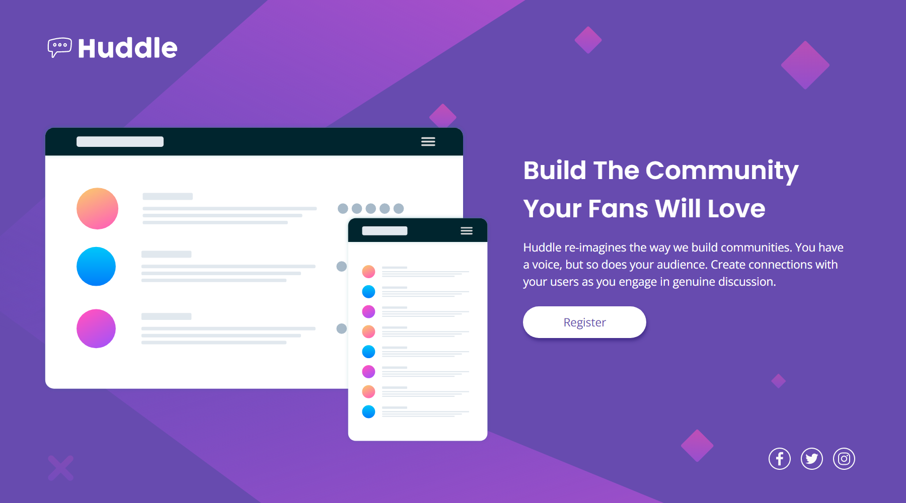

# Frontend Mentor - Huddle landing page with single introductory section solution

This is a solution to the [Huddle landing page with single introductory section challenge on Frontend Mentor](https://www.frontendmentor.io/challenges/huddle-landing-page-with-a-single-introductory-section-B_2Wvxgi0). Frontend Mentor challenges help you improve your coding skills by building realistic projects. 

## Table of contents

- [The challenge](#the-challenge)
- [Screenshot](#screenshot)
- [Links](#links)
- [My process](#my-process)
  - [HTML structure](#html-structure)
  - [Spacing units](#spacing-units)
  - [Chrome](#chrome)
  - [Colors](#colors)
  - [Tablet](#tablet)
- [Useful resources](#useful-resources)
- [Author](#author)

## The challenge

Users should be able to:

- View the optimal layout for the page depending on their device's screen size
- See hover states for all interactive elements on the page

## Screenshot

## Links

- Solution URL: [GitHub Repository](https://github.com/joangute/huddle-landing-page/)
- Live Site URL: [GitHub Pages](https://joangute.github.io/huddle-landing-page/)

## My process

### HTML structure

This was a real challenge for me and I asumme for newbies in web desing too, since my previus challenges were single components I started this page whitout the basic landing page structure( header,main,footer), so I had to add and remove containers many times for a correct positioning in mobile and desktop, finally all those changes led me to have actual header,main and footer.

### Spacing units

This part is not as clean as I would like, I have a mixing of rem,vh,vw and % for spacing. I started with just rem and %, then when I tested the desing in many mobile, desktop and tablet sizes I had to use vh and vw units and this way positioning elements as close to the design as possible. I hope to improve this in the near future.

### Chrome

I use chrome Device Mode tool to test the desing, but it has some drawbacks, when I hover over the screen and hold down the mouse, the screen resizes into a weird an imperceptible(sometimes) form, because of this I was using wrong spacing in my design and I have to fix it once or twice.

### Colors

This was the funny part, choosing the colors were not on the style-guide file like button shadow and icons on hover.

### Tablet

How this challenge took me more time than planned I decided to add a tablet design to the solution to make it worthwhile.

## Useful resources

- [Percentage calculator](https://www.calcularporcentajeonline.com/) - This helped me to calc some margins and paddings.
- [SVG icons](https://www.iconfinder.com/) - Here you can find free icons, I used it to get the social media icons.
- [Color palette generator](https://mycolor.space/) - I used this to get the button shadow.
- [HEX to HSL color converter](https://htmlcolors.com/hex-to-hsl/) - This was very useful to work whit some apps that don't use HSL format.

## Author

- Frontend Mentor - [@joangute](https://www.frontendmentor.io/profile/joangute/)

